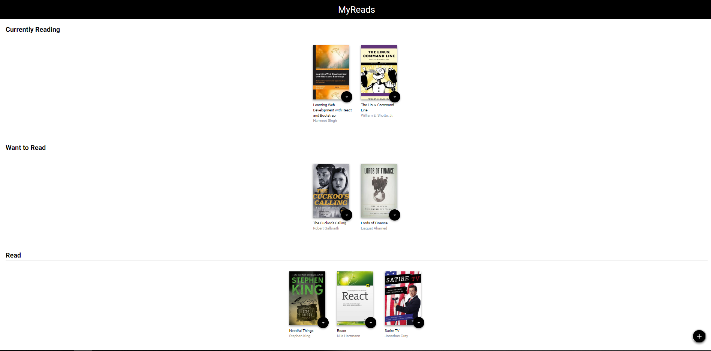
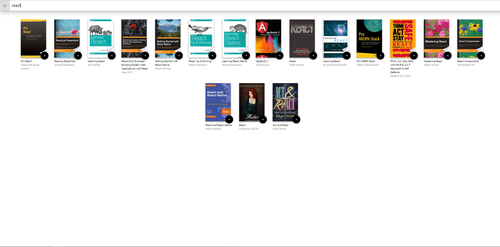

# MyReads

---

## Project Purpose:

This project is part of Udacity Full Stack nanodegree program. The main purpose is to training my knowledges in React.

Two versions of this application was built. One at 'redux' branch I implemented using redux library and at 'master' branch we have a version without redux library.

## How to Run the Application

The project uses Node.js and the Create-React-App starter. If you do not have Node >= 6.x installed, you can download it here: [Node.js](https://nodejs.org/en/)

Once Node is installed, navigate to the directory where you want to store the app

```
git clone https://github.com/cassioesp/my-reads.git
npm install
```

Once all of the dependencies have been installed you can launch the app with

```
npm start
```

A new browser window should automatically open displaying the app. If it doesn't, navigate to [http://localhost:3000/](http://localhost:3000/) in your browser

## Screenshots

- Books are divide into three bookshelves: Currently Reading, Want to Read and Read
  
- To change a book's shelf or remove a book from the list, click on the black button on the book cover.
- To search new books by author or title, click on the black + button at the bottom of the page.
  

#### Search Terms
Note: The backend API is limited to a fixed set of [search terms](#search-terms) -- see below for valid search options --

'Android', 'Art', 'Artificial Intelligence', 'Astronomy', 'Austen', 'Baseball', 'Basketball', 'Bhagat', 'Biography', 'Brief', 'Business', 'Camus', 'Cervantes', 'Christie', 'Classics', 'Comics', 'Cook', 'Cricket', 'Cycling', 'Desai', 'Design', 'Development', 'Digital Marketing', 'Drama', 'Drawing', 'Dumas', 'Education', 'Everything', 'Fantasy', 'Film', 'Finance', 'First', 'Fitness', 'Football', 'Future', 'Games', 'Gandhi', 'History', 'History', 'Homer', 'Horror', 'Hugo', 'Ibsen', 'Journey', 'Kafka', 'King', 'Lahiri', 'Larsson', 'Learn', 'Literary Fiction', 'Make', 'Manage', 'Marquez', 'Money', 'Mystery', 'Negotiate', 'Painting', 'Philosophy', 'Photography', 'Poetry', 'Production', 'Program Javascript', 'Programming', 'React', 'Redux', 'River', 'Robotics', 'Rowling', 'Satire', 'Science Fiction', 'Shakespeare', 'Singh', 'Swimming', 'Tale', 'Thrun', 'Time', 'Tolstoy', 'Travel', 'Ultimate', 'Virtual Reality', 'Web Development', 'iOS'

